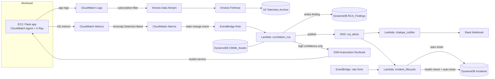

# AIOps Self-Healing Pipeline on AWS

 A monitored workload streams telemetry,
CloudWatch's built-in ML anomaly detection flags abnormal behavior, a Lambda
correlates and root-causes the alert, and the system automatically remediates
itself, notifies Slack, and opens/closes its own ITSM ticket — with no human
in the loop.

Most "monitoring" projects stop at a dashboard. This one closes the
loop: **detect → correlate → explain → remediate → notify → track → verify**.
That closed loop

# Key Infrastructure & Tech Stack
Infrastructure as Code: Fully provisioned and managed using Terraform (>= 1.5).

Compute & Application: AWS EC2 (t3.micro), Python Flask, AWS X-Ray SDK.

Serverless Operations: AWS Lambda (Python), Amazon EventBridge, Amazon SNS.

Storage & Databases: Amazon S3, Amazon DynamoDB (3 tables: CMDB Assets, RCA Findings, Incidents).

Monitoring & Data Streaming: AWS CloudWatch (Metrics, Logs, Alarms), Kinesis Data Streams, Kinesis Firehose.

Automation: AWS SSM Automation Documents.

# Architecture


**The loop, in order:**
1. **Ingest** — EC2 workload instrumented with the CloudWatch Agent (OS metrics,
   app logs) and AWS X-Ray (traces). Logs stream via a Kinesis subscription
   filter → Firehose → S3.
2. **Detect** — CloudWatch's native ML Anomaly Detection bands watch CPU
   utilization and application error rate; alarms fire only on out-of-band
   values, not fixed thresholds.
3. **Correlate + RCA** — An EventBridge rule routes alarm state changes to the
   `correlation_rca` Lambda, which de-dupes repeat alarms within a 2-minute
   window, looks up the affected resource in a DynamoDB CMDB, classifies a
   probable root cause, and writes a finding to `RCA_Findings`.
4. **Remediate** — For alarms on the high-confidence list, the same Lambda
   kicks off an SSM Automation runbook that restarts the affected service —
   no human approval step.
5. **Notify** — The finding fans out over SNS to a `chatops_notifier` Lambda
   that posts a formatted alert to Slack.
6. **Track** — An `incident_lifecycle` Lambda opens a ticket in a DynamoDB
   `Incidents` table on the same SNS fan-out, then a 5-minute EventBridge
   sweep auto-closes it once the alarm returns to `OK`.




## Repo layout

```
terraform/       All infrastructure (EC2, Kinesis/Firehose/S3, DynamoDB,
                  CloudWatch anomaly alarms, EventBridge, SSM, IAM, Lambda wiring)
app/              Flask demo workload instrumented with X-Ray
lambdas/          correlation_rca, incident_lifecycle, chatops_notifier
runbooks/         SSM Automation document (self-healing action)
scripts/          fault_injection.sh (demo trigger), cleanup.sh (teardown)
```

## Setup

**Prerequisites:** Terraform >= 1.5, an AWS account/credentials with
admin-ish permissions for this demo scope, `zip` available locally is not
required (Terraform's `archive_file` handles Lambda packaging).

```bash
cd terraform
cp terraform.tfvars.example terraform.tfvars
# edit terraform.tfvars: set my_ip_cidr (curl -s ifconfig.me) and, optionally, slack_webhook_url

terraform init
terraform apply
```

This provisions one `t3.micro` EC2 instance, a Kinesis stream + Firehose, an
S3 bucket, three DynamoDB tables, CloudWatch anomaly alarms, three Lambdas,
an SSM Automation document, and the EventBridge/SNS wiring between them.
Estimated cost if left running: a few dollars a day, dominated by the EC2
instance and Kinesis shard-hour — **run `scripts/cleanup.sh` when you're done
for the day.**

## Running the demo

```bash
INSTANCE_ID=$(terraform -chdir=terraform output -raw app_instance_id)
./scripts/fault_injection.sh "$INSTANCE_ID"
```

This injects synthetic CPU load via SSM Run Command and triggers the full
chain: anomaly alarm → RCA finding → Slack alert → automated remediation →
incident ticket → auto-close. Watch the `RCA_Findings` and `Incidents`
DynamoDB tables and the CloudWatch console alongside the Slack channel.

*(Demo GIF goes here — record the DynamoDB console + Slack channel side by
side while `fault_injection.sh` runs.)*

## What's not built yet

This is a deliberately scoped weekend build, as natural v2 extensions:
- **SageMaker DeepAR forecasting** for 7-day capacity planning over the
  Athena/S3 archive.
- **Amazon Lookout for Metrics** for business-metric anomaly detection
  (transaction volume, order success rate) alongside the infra-metric
  detection built here.
- **EKS + Container Insights** with HPA/Cluster Autoscaler for containerized
  workload autoscaling.
- **AWS Chatbot** (managed) instead of a custom webhook Lambda, and a real
  X-Ray trace walk in the RCA Lambda instead of metric-name heuristics.
- **FinOps digest** via Cost Explorer + Compute Optimizer.

## Teardown

```bash
./scripts/cleanup.sh
```

Runs `terraform destroy` and force-empties the S3 bucket (Terraform won't
delete a non-empty bucket on its own).
